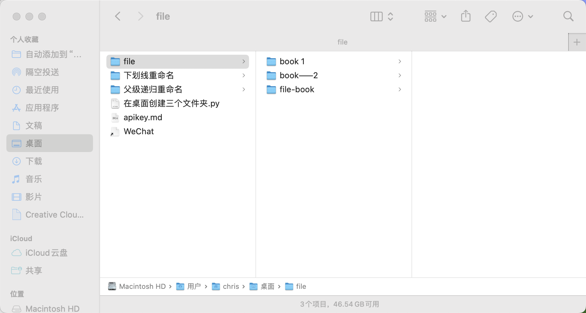
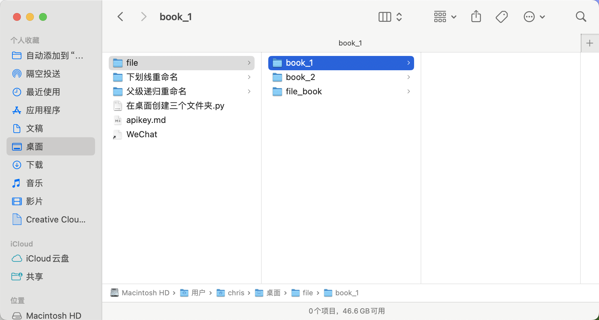

# Underline rename

Explanation: This project is to better manage the file directory, can automatically: () space, (--) Chinese dash, English bar (-) replaced with English underscore (_).

[中文](./README) | [ENLGLISH](./README_ENGLISH)

#### before use

#### after use

